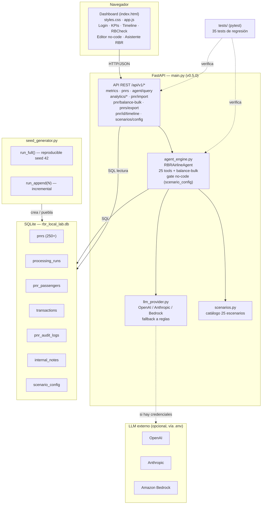

# Arquitectura — RBR Airline Insight Engine (v0.5.0)

Vista de componentes del laboratorio local: frontend estático, backend FastAPI,
motor del agente con capa LLM opcional, base SQLite de 7 tablas y el generador de
semilla (full / incremental). La suite pytest verifica API y agente.

## Flujo típico

1. El navegador carga el dashboard (`index.html` + `styles.css` + `app.js`) servido por FastAPI.
2. Las acciones del usuario llaman endpoints `/api/v1/*`.
3. El `RBRAirlineAgent` resuelve la intención: consulta SQLite y, para texto generativo (resumen ejecutivo), usa el LLM si hay credenciales o cae a reglas locales.
4. El balanceo (individual o masivo) respeta `scenario_config`: una regla desactivada no se concilia.
5. `seed_generator.py` crea la base reproducible (`run_full`) o agrega datos sin borrar (`run_append`).
